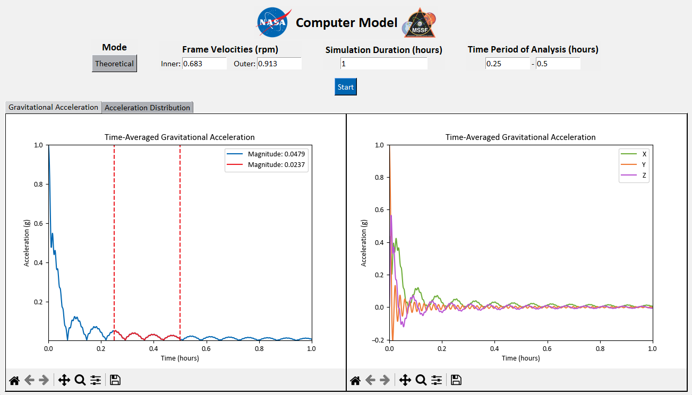

<br />
<div align="center">
  <a href="https://public.ksc.nasa.gov/partnerships/capabilities-and-testing/testing-and-labs/microgravity-simulation-support-facility/">
    
  </a>
</div>

## Overview

<div align="center">
  
</div>

The Microgravity Simulation Support Facility (MSSF) at the National Aeronautics and Space Administration
(NASA) John F. Kennedy Space Center (KSC) contains an array of devices that negate the directional
influence of the “g” vector to simulate micro- and partial-gravity. The MSSF has developed a graphical user
interface (GUI) application for visualizing the accelerations felt by a sample when rotating in these devices to
allow scientists to evaluate the quality of their simulations.

## Built With

[![Python][python-logo]](https://www.python.org/)

[python-logo]: https://img.shields.io/badge/Python-3776AB?style=for-the-badge&logo=python&logoColor=white

## Usage

1. Install the necessary dependencies by running:

   ```bash
   pip install -r requirements.txt
   ```

2. Open the graphical user interface (GUI) by running:

   ```bash
   python gui.py
   ```

   or, if you prefer to create an executable file, you can do so by running:

   ```bash
   python -m PyInstaller executable.spec
   ```

   After creating the executable file, you can run it directly from the output directory (usually `dist/`).

## References

1. Kim, Y.J., Jeong, A.J., Kim, M. _et al_. Time-averaged simulated microgravity (taSMG) inhibits proliferation of lymphoma cells, L-540 and HDLM-2, using a 3D clinostat. _BioMed Eng OnLine_ **16**, 48 (2017). https://doi.org/10.1186/s12938-017-0337-8

2. Clary JL, France CS, Lind K, Shi R, Alexander JS, Richards JT, Scott RS, Wang J, Lu X-H and Harrison L (2022) Development of an inexpensive 3D clinostat and comparison with other microgravity simulators using _Mycobacterium marinum. Front. Space Technol_. 3:1032610. https://doi.org/10.3389/frspt.2022.1032610
